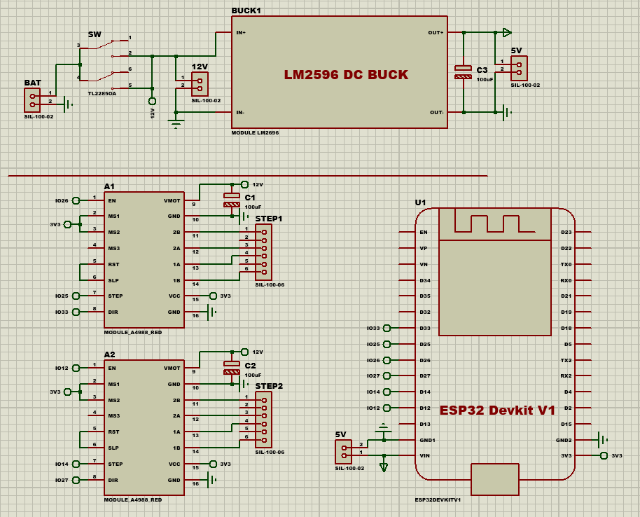

# CONTROL STEP MOTOR ESP32 + A4988 

## 1. Introduce
- Control 2 step motor by driver A4988 and ESP32 via enter parameter in serial

## 2. Accessory
- ESP32 DevKit V1
- Driver A4988 x2
- STEP MOTOR 42mm x2
- Power 12V
- LM2596 to convert 12V down to 5V use for ESP32
- Switch 6 Pin

## 3. Schematic
Connect with picture:

